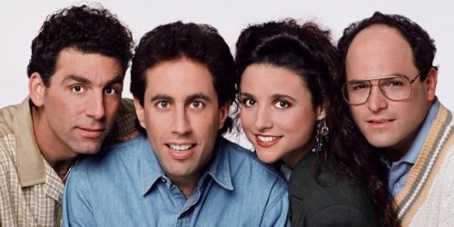
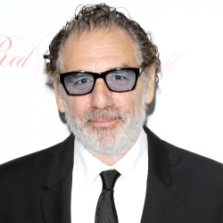
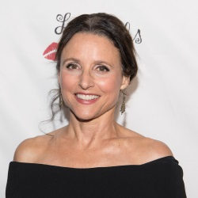

# go-face-demo1
Testing faces recognition in Go using [go-face](https://github.com/Kagami/go-face) library.

[go-face](https://github.com/Kagami/go-face) implements face recognition for Go using [dlib](http://dlib.net/)'s state-of-the-art face recognition built with deep learning. The model has an accuracy of 99.38% on the [Labeled Faces in the Wild](http://vis-www.cs.umass.edu/lfw/) benchmark.

# Demo

We have a group photo of the cast of [Seinfeld](https://www.imdb.com/title/tt0098904/):

|  |
| --- |
| The *Seinfeld* cast: Kramer, Jerry, Elaine and George |

And here are recents photos of the actors:

|  |  |  |  |
| --- | --- | --- | --- |
| Kramer | Jerry | Elaine | George |

We ran the demo on each individual actor photo:

```
$ go-face-demo1 --group seinfeld.jpg --names Kramer,Jerry,Elaine,George --target jerry.jpg
# GO-FACE DEMO #1
## Detect faces on seinfeld.jpg
- Detected: Kramer
- Detected: Jerry
- Detected: Elaine
- Detected: George
## Recognize face on jerry.jpg
- Found: Jerry

$ go-face-demo1 --group seinfeld.jpg --names Kramer,Jerry,Elaine,George --target kramer.jpg
# GO-FACE DEMO #1
## Detect faces on seinfeld.jpg
- Detected: Kramer
- Detected: Jerry
- Detected: Elaine
- Detected: George
## Recognize face on kramer.jpg
- Found: Kramer

$ go-face-demo1 --group seinfeld.jpg --names Kramer,Jerry,Elaine,George --target george.jpg
# GO-FACE DEMO #1
## Detect faces on seinfeld.jpg
- Detected: Kramer
- Detected: Jerry
- Detected: Elaine
- Detected: George
## Recognize face on george.jpg
- Found: George

$ go-face-demo1 --group seinfeld.jpg --names Kramer,Jerry,Elaine,George --target elaine.jpg
# GO-FACE DEMO #1
## Detect faces on seinfeld.jpg
- Detected: Kramer
- Detected: Jerry
- Detected: Elaine
- Detected: George
## Recognize face on elaine.jpg
- Found: Elaine
```

Notice that Jerry and Kramer wears glasses now, but even though the library could recognize all the actors, quite amazing !
